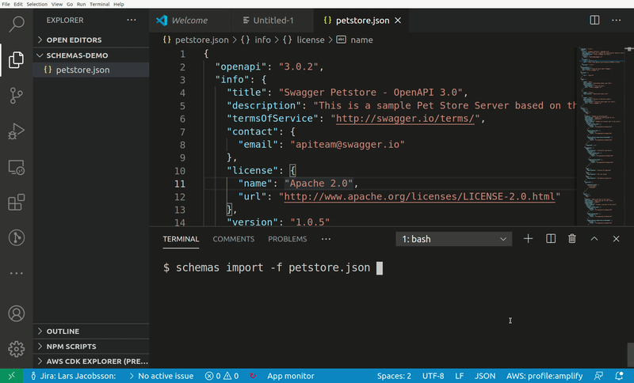
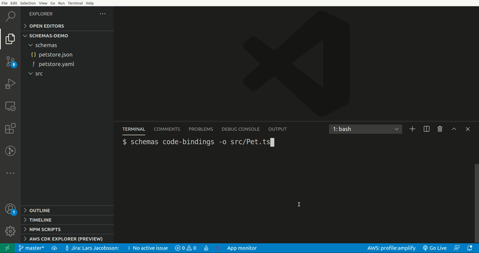

# schemas-cli

CLI took that lets you import OpenAPI definitions into Amazon EventBridge Schema registry. These schemas can then be used to generate code bindings in a [variety of languages](https://github.com/quicktype/quicktype#target-languages)

## Installation
`npm install -g @mhlabs/schemas-cli`

## Features
* Imports OpenAPI 3 schemas from URL or file to EventBridge Schema Registry
* Lets you browse all schema registries and generate code bindings in a large range of languages
* Lets you browse your API Gateways and generate code bindings from any OpenAPI 3 schema you may have associated with your APIs
* Supports both YAML and JSON

## Demo
Browsing Amazon EventBridge Schema Registry:


Browsing files on your local computer:


## Commands

### `$ schemas import`

```
Usage: index import|i [options]

Imports OpenAPI3 speficications from file or URL into Amazon EventBridge Schema Registry

Options:
  -f, --file [file-path]         OpenAPI Input file (optional. One of
                                 --file or --url has to be specified)
  -u, --url [url]                URL to OpenAPI definition (optional. One
                                 of --file or --url has to be specified)
  -r, --registry [registryName]  URL to OpenAPI definition (optional)
  -p, --profile [profile]        AWS profile to use
  --region [region]              The AWS region to use. Falls back on
                                 AWS_REGION environment variable if not
                                 specified
  -h, --help                     display help for command
```

### `$ schemas code-bindings`

```
Usage: schemas code-bindings|cb [options]

Starts a schema registry browser and outputs code bindings

Options:
  -f, --file [filePath]            File path to OpenAPI definition (optional)
  -u, --url [url]                  URL to OpenAPI definition (optional)
  -l, --language [language]        Output language (optional)
  -o, --output-file [output-file]  Output file (optional. Writes to std-out if omitted)
  -p, --profile [profile]          AWS profile to use (default: "default")
  --region [region]                The AWS region to use. Falls back on AWS_REGION environment variable if not specified
  -h, --help                       display help for command
  
```
